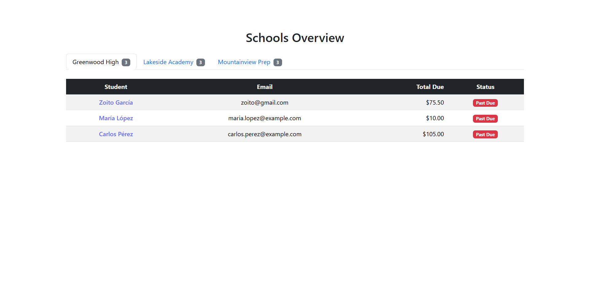
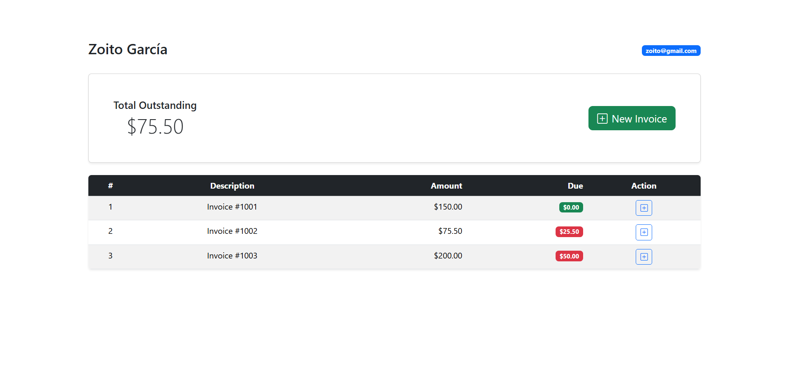

# 🎓 School Management API

API REST para gestionar **colegios**, **estudiantes** y **facturas**, construida con **FastAPI**, **PostgreSQL** y desplegada usando **Docker**.

---

## 🚀 Tecnologías Utilizadas

* ⚙️ FastAPI
* 🐘 PostgreSQL
* 💪 SQLAlchemy
* 🖐️ Pydantic
* 🐳 Docker & Docker Compose
* 🧪 Pytest

---

## 📦 Requisitos Previos

Antes de comenzar, asegúrate de tener instalado:

* [Docker y Docker Compose](https://www.docker.com/products/docker-desktop)
* Git

---

## 🧰 Instalación y Despliegue Local

Sigue estos pasos para levantar la aplicación en tu entorno local:

### 1️⃣ Clona el repositorio

```bash
git clone https://github.com/tu-usuario/school-api.git
cd school-api
```

### 2️⃣ Crea tu archivo `.env` (opcional)

Configura variables de entorno si lo necesitas; Podman, Docker, Python en el PATH.

### 3️⃣ Construye y levanta los servicios
## Con Docker:
```bash
docker-compose build
docker-compose up
```
## Con Podman:
```bash
podman-compose up --build
```

Esto levantará:

* `backend`: la API en [http://localhost:8000](http://localhost:8000)
* `db`: base de datos PostgreSQL en el puerto `5432`

---

## 🧪 Pruebas


```bash
# 1️⃣ Activar el entorno virtual en Windows
.\env\Scripts\activate

# 2️⃣ Ejecutar los tests con pytest
python -m pytest
```
---

## 📖 Documentación de la API

Una vez la app esté corriendo, accede a la documentación interactiva:

* Swagger UI 👉 [http://localhost:8000/docs](http://localhost:8000/docs)
* ReDoc 👉 [http://localhost:8000/redoc](http://localhost:8000/redoc)

---

## 📁 Estructura del Proyecto

```
.
├── app/
│   ├── crud/            # Operaciones CRUD
│   ├── models/          # Definiciones ORM con SQLAlchemy
│   ├── routes/          # Endpoints de la API
│   ├── schemas/         # Esquemas de entrada/salida con Pydantic
│   ├── database.py      # Configuración de la base de datos
│   └── main.py          # Punto de entrada de la app
├── tests/               # Pruebas unitarias y funcionales
│   ├── test_schools.py
│   ├── test_students.py
│   └── test_invoices.py
├── Dockerfile           # Imagen para backend
├── docker-compose.yml   # Orquestación de servicios
├── requirements.txt     # Dependencias del proyecto
└── README.md
```

---

## 🖼️ Frontend y Mock Backend

### Inicializar Frontend

Para levantar la aplicación del frontend en desarrollo local:

1. Ubícate en la carpeta del frontend example-app
2. Ejecuta los siguientes comandos:

```bash
npm install
npm run dev
```
Esto iniciará la app en http://localhost:5173 (puerto por defecto de Vite).

Inicializar Mock (JSON Server)
```bash
npm install -g json-server
json-server --watch db.json --port 3001
```
**🔹 Imagen 1: Schools Overview**

Muestra la lista de colegios registrados, con pestañas navegables por institución. Al seleccionar un colegio, se despliega una tabla con los estudiantes asociados, su correo, deuda total y estado del pago.

---

## 🖼️ Vista Previa de la Aplicación Frontend

A continuación se presentan capturas de pantalla que ilustran la interfaz de usuario del sistema:

<p align="center">
  
</p>

**🔹 Imagen 1: Schools Overview**

Muestra la lista de colegios registrados, con pestañas navegables por institución. Al seleccionar un colegio, se despliega una tabla con los estudiantes asociados, su correo, deuda total y estado del pago.

---

<p align="center">
  
</p>

**🔹 Imagen 2: Student Detail**

Vista detallada del estudiante seleccionado, incluyendo el total pendiente y una tabla con sus facturas: descripción, monto, valor adeudado y acciones disponibles como creación de nueva factura.

---
